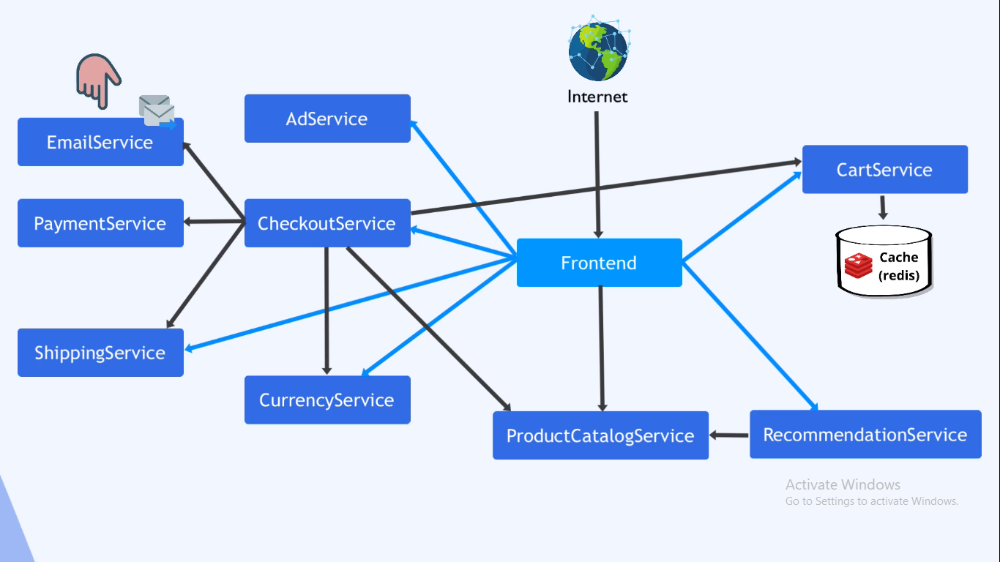
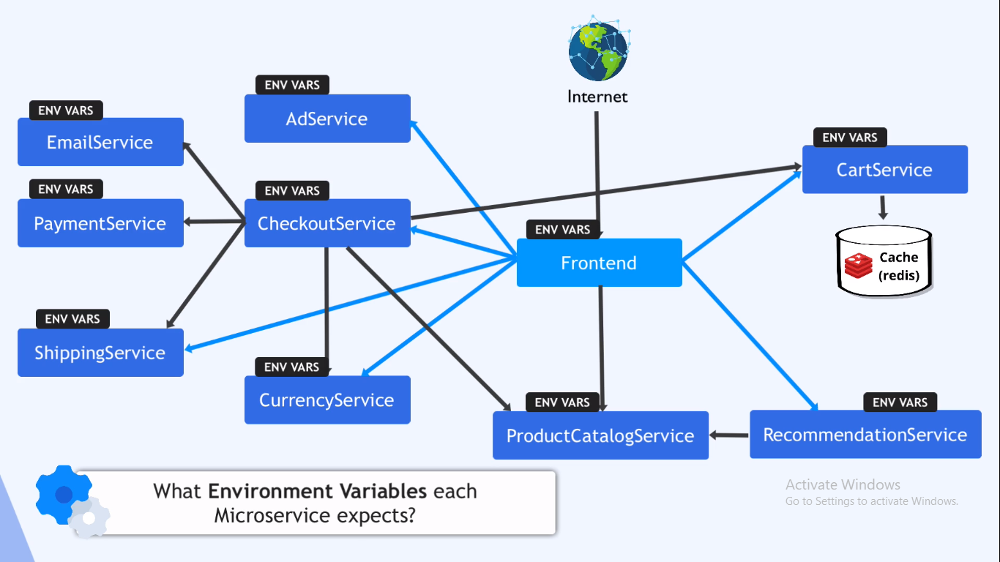
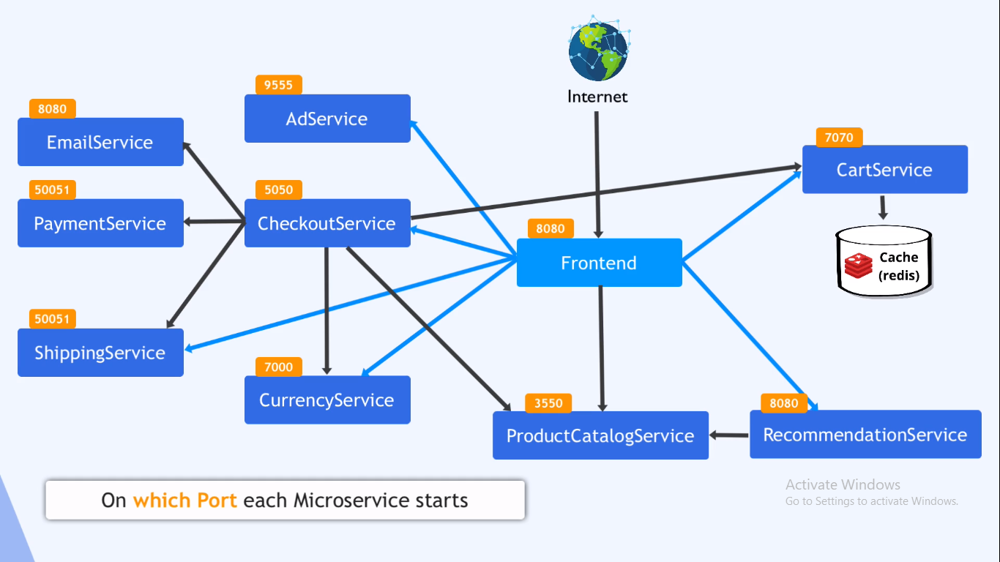

# Microservice Demo Application -  Kubernetes

Project to deploy a microservices application from [Google-Microservices Demo](https://github.com/GoogleCloudPlatform/microservices-demo) using Kubernetes.

The platform is an Online Boutique consisting of an 11-tier microservice application enabling users browse items, add them to the cart and purchase them.

Created YAML files with the 11 deployments and corresponding manifests. All services components are internal services, except frontend service which is accessed via browser.

The flowchart if the microservice deployment is as shown:



To show and achieve the interconnection of different microservices, environment variables were used:



The different ports in which different microservices were running is as shown below:




## Best Practices in Microservices Deployment

1. Add the version to each container image and ensure that the image version is same for each microservice.

    Implementation of this best practice:
    ```
    image: gcr.io/google-samples/microservices-demo/emailservice:v0.2.3
    ```

2. Configure liveness probe on each container. The probe performs health checks after the container has started. Remember the container address changes dependending on the container port number.

There are 3 types of executing liveness probe:
- `Exec probes` - Kubectl executes specific command to check the health

    Implementation of this best practice:
    ```
    livenessProbe:
          periodSeconds: 5
          exec:
            command: ["/bin/grpc_health_probe", "-addr=:8080"]
    ```

- `TCP probes` - Kubectl makes probe connection at the node and not the pod

    Implementation of this best practice:
    ```
    livenessProbe:
          initialDelaySeconds: 5
          periodSeconds: 5
          tcpSocket:
            port: 6379
    ```

- `HTTP probes` - Kubectl sends HTTP requests to specified ports and paths.

    Implementation of this best practice:
    ```
        livenessProbe:
            periodSeconds: 5
            httpGet:
                path: /health
                port: 3550
    ```

3. 